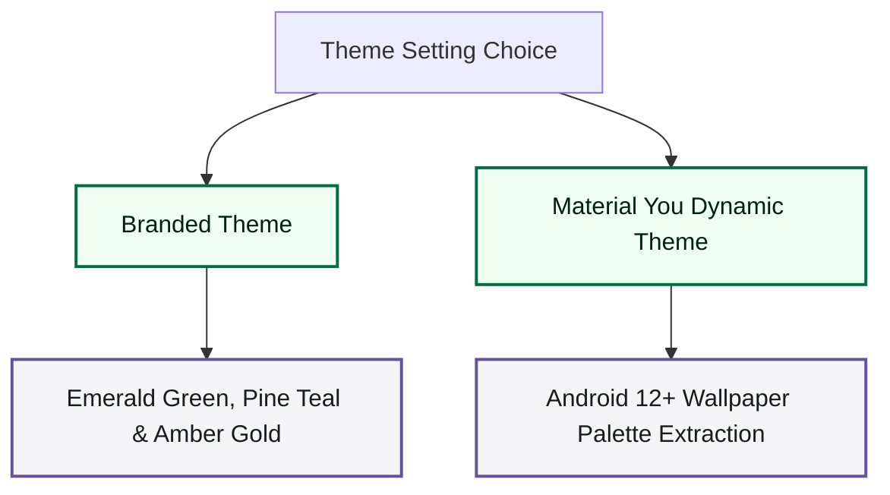

# Chobi Design System: M3 Expressive Updates

This document outlines the visual system updates designed and implemented in the Chobi budget tracking application. These changes are aligned with the official **Material 3 Expressive Design** guidelines.

## 🎨 Dual Theme Palette Strategy

Chobi supports two distinct visual palette styles, giving the user flexibility between custom branding and operating system integration.

### 1. Branded Theme (Default)
Our custom-designed financial ledger palette uses rich, professional organic colors:
*   **Emerald & Mint Greens:** Symbolizing wealth, balance, and transaction status (`#006D44` light, `#74D9A3` dark).
*   **Pine & Sage Teals:** For accents and secondary transaction categorization.
*   **Amber Golds:** Representing savings and active budget constraints.
*   **Slate Emerald Backdrops:** Sophisticated, very dark green-slate background for dark mode (`#0E1511`), and soft light green-white for light mode (`#F4FBF6`).

### 2. Material You (Dynamic)
Utilizes the Android system's wallpaper color extraction algorithm to dynamically tint the entire UI, integrating the app seamlessly with the user's operating system environment.

---

## 🔠 M3 Expressive Typography

To follow the Material 3 Expressive guidelines, we paired a distinguished **Serif** typeface for brand & display roles (for an elegant ledger feel) with a highly readable **Sans-Serif** typeface for utility roles (body text, actions, and labels).

| Role | Font Family | Weight | Size (sp) | Description / Usage |
| :--- | :--- | :--- | :--- | :--- |
| **Display Large** | Serif | Light | `57` | Major showcase numbers |
| **Display Medium** | Serif | Normal | `45` | Main total amount numbers |
| **Display Small** | Serif | Normal | `36` | Key metrics, budget remaining balance |
| **Headline Large** | Serif | SemiBold | `32` | Big headers and sheet entries |
| **Headline Medium** | Serif | SemiBold | `28` | Dialog and main transaction input titles |
| **Headline Small** | Serif | SemiBold | `24` | Input amounts and section subtitles |
| **Title Large** | Serif | Bold | `22` | App Bar title ("Chobi") and transaction item amounts |
| **Title Medium** | Sans-Serif | SemiBold | `16` | Transaction item titles and group headers |
| **Title Small** | Sans-Serif | Medium | `14` | Dialog sub-headers and card actions |
| **Body Large** | Sans-Serif | Normal | `16` | Main descriptive and copy text |
| **Body Medium** | Sans-Serif | Normal | `14` | Secondary instructions and info labels |
| **Body Small** | Sans-Serif | Normal | `12` | List item date labels, tiny details |
| **Label Large** | Sans-Serif | Medium | `14` | Category chips, button text labels |
| **Label Medium** | Sans-Serif | Medium | `12` | Badge numbers and small chip labels |

---

## ⚙️ Theme Preference Controls

We added two segmented choice controls within the app settings dialog:

1.  **Color Style:**
    *   **Branded:** Restores the custom Emerald / Teal palette.
    *   **Material You:** Dynamically extracts the palette from the device's wallpaper (Android 12+).
2.  **Theme Mode:**
    *   **Light:** Forces light mode colors.
    *   **Dark:** Forces dark mode colors.
    *   **Auto:** Matches system-wide light/dark preferences dynamically.

These selections are stored asynchronously in Jetpack DataStore under the keys `dynamic_color` and `theme_mode`, and are collected responsively inside `MainActivity`.
